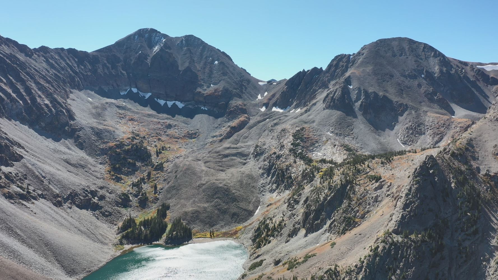

# 1_LakeAgnesRG

This project is looking at water quality data and ice content indicators for the Lake Agnes Rock Glacier, CO. 

In Colorado, rock glaciers vastly outnumber traditional ice glaciers and cover a larger spatial extent, suggesting that they may contain a larger volume of ice than glaciers themselves. In certain basins, the reduced climate sensitivity of rock glaciers and their sustained cold-water input to mountain streams will likely provide a refuge for cold-water aquatic species in a warming climate. 

Comprehensive characterization of the Lake Agnes rock glacier is a first step in understanding the role of rock glaciers in alpine basins within northern Colorado, features which are an often-disregarded component of the alpine water budget. A summary of this project and preliminary results can be found [here.](https://briannarick.github.io/dataviz/RCOP_poster_150dpi.jpg)

**Datasets:** 

* Ion concentrations, pH, temperature, and electrical conductivity for seven streams in the basin from summers 2019, 2020, and 2021 [-- see preliminary results here](https://briannarick.github.io/1_LakeAgnesRG/src/00_waterQA_import.html)

* Hydrographs for two streams summers 2019, 2020, and 2021

* Bottom temperature of snow for 3 on rock glacier and 2 off rock glacier (control) temperature loggers capturing winters 2018-19 and 2019-20

* Displacement vectors for the rock glacier between 2019 and 2021, calculated using SfM imagery in QGIS (IMCORR module)

* Ground-penetrating radar (GPR) for internal rock glacier structure
