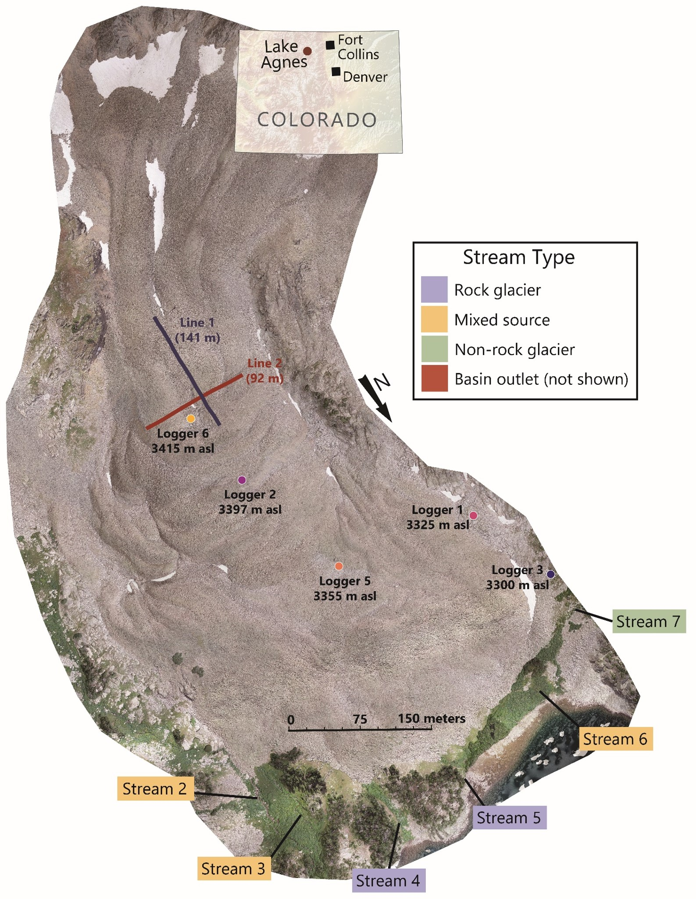

```{r download-packages, include=FALSE}

library(ggplot2)
library(dplyr)
library(gridExtra)

knitr::opts_chunk$set(echo = FALSE,  message = FALSE, warning = FALSE)
```


```{r import-data, include=FALSE}
## Import the water quality data

setwd("C:/Users/Bri/Documents/CSU/EnvDataScience2022/1_waterQA_RG")

hydroAll <- read.csv("C:/Users/Bri/Documents/CSU/Field Work/WaterSamples/AllData_IonIsotope_2019_2021_June2022.csv")

```

### Explore the data

Here we are looking at the water quality data for 7 different streams in the Lake Agnes Basin. Streams are classified as RG (purely rock glacier fed), NRG (no rock glacier source), Mixed (combination of RG and NRG sources), Outlet (outlet stream of the basin, below the lake), RGice (sample taken from the top of the RG, in contact with ice), and Snow (sample of snow). These samples were taken over the years 2019, 2020, and 2021. We are interested in identifying similarities/differences between stream types, as well as trends throughout the season.



### Total Dissolved Nitrogen

```{r TDN, fig.width=8, fig.height=3}
ggplot()+
  geom_point(aes(x = DOY, y = TDN, color = SType, shape = as.factor(Year) ), data = hydroAll) +
  theme_bw()+
  #theme(legend.position = c(.9, .1))+
  facet_grid(~SType) +
  xlab("Day of year") +
  ylab("TDN (mg/L)")
```

### Sodium

```{r Na, fig.width=8, fig.height=3}
ggplot()+
  geom_point(aes(x = DOY, y = Na.1, color = SType, shape = as.factor(Year) ), data = hydroAll, show.legend = FALSE) +
  theme_bw()+
  theme(legend.position = c(.9, .1))+
  facet_grid(~SType)+
  xlab("Day of year") +
  ylab("Na (ueq/L)")
```

### Ammonium

```{r NH4, fig.width=8, fig.height=3}
ggplot()+
  geom_point(aes(x = DOY, y = NH4.1, color = SType, shape = as.factor(Year) ), data = hydroAll, show.legend = FALSE) +
  theme_bw()+
  theme(legend.position = c(.9, .1))+
  facet_grid(~SType)+
  xlab("Day of year") +
  ylab("Ammonium (ueq/L)")
```

### Potassium

```{r K, fig.width=8, fig.height=3}
ggplot()+
  geom_point(aes(x = DOY, y = K.1, color = SType, shape = as.factor(Year) ), data = hydroAll, show.legend = FALSE) +
  theme_bw()+
  theme(legend.position = c(.9, .1))+
  facet_grid(~SType)+
  xlab("Day of year") +
  ylab("K (ueq/L)")
```

### Magnesium

```{r Mg, fig.width=8, fig.height=3}
ggplot()+
  geom_point(aes(x = DOY, y = Mg.1, color = SType, shape = as.factor(Year) ), data = hydroAll, show.legend = FALSE) +
  theme_bw()+
  theme(legend.position = c(.9, .1))+
  facet_grid(~SType)+
  xlab("Day of year") +
  ylab("Mg (ueq/L)")
```

### Calcium

```{r Ca, fig.width=8, fig.height=3}
ggplot()+
  geom_point(aes(x = DOY, y = Ca.1, color = SType, shape = as.factor(Year) ), data = hydroAll, show.legend = FALSE) +
  theme_bw()+
  theme(legend.position = c(.9, .1))+
  facet_grid(~SType)+
  xlab("Day of year") +
  ylab("Ca (ueq/L)")
```

### Chlorine

```{r Cl, fig.width=8, fig.height=3}
ggplot()+
  geom_point(aes(x = DOY, y = CL, color = SType, shape = as.factor(Year) ), data = hydroAll, show.legend = FALSE) +
  theme_bw()+
  theme(legend.position = c(.9, .1))+
  facet_grid(~SType)+
  xlab("Day of year") +
  ylab("Cl (ueq/L)")
```

### Nitrate

```{r NO3, fig.width=8, fig.height=3}
ggplot()+
  geom_point(aes(x = DOY, y = NO3.1, color = SType, shape = as.factor(Year) ), data = hydroAll, show.legend = FALSE) +
  theme_bw()+
  theme(legend.position = c(.9, .1))+
  facet_grid(~SType)+
  xlab("Day of year") +
  ylab("Nitrate (ueq/L)")
```

### Sulfate

```{r SO4, fig.width=8, fig.height=3}
ggplot()+
  geom_point(aes(x = DOY, y = SO4.1, color = SType, shape = as.factor(Year) ), data = hydroAll, show.legend = FALSE) +
  theme_bw()+
  theme(legend.position = c(.9, .1))+
  facet_grid(~SType)+
  xlab("Day of year") +
  ylab("Sulfate (ueq/L)")
```

### Nitrate Nitrogen

```{r NO3N, fig.width=8, fig.height=3}
ggplot()+
  geom_point(aes(x = DOY, y = NO3N, color = SType, shape = as.factor(Year) ), data = hydroAll, show.legend = FALSE) +
  theme_bw()+
  theme(legend.position = c(.9, .1))+
  facet_grid(~SType)+
  xlab("Day of year") +
  ylab("Nitrate Nitrogen (mg/L)")
```

### Dissoled Inorganic Nitrogen

```{r DIN, fig.width=8, fig.height=3}
ggplot()+
  geom_point(aes(x = DOY, y = DIN, color = SType, shape = as.factor(Year) ), data = hydroAll, show.legend = FALSE) +
  theme_bw()+
  theme(legend.position = c(.9, .1))+
  facet_grid(~SType)+
  xlab("Day of year") +
  ylab("Dissolved Inorganic Nitrogen (mg/L)")
```

### Dissolved Organic Nitrogen

```{r DON, fig.width=8, fig.height=3}
ggplot()+
  geom_point(aes(x = DOY, y = DON, color = SType, shape = as.factor(Year) ), data = hydroAll, show.legend = FALSE) +
  theme_bw()+
  theme(legend.position = c(.9, .1))+
  facet_grid(~SType)+
  xlab("Day of year") +
  ylab("Dissolved Organic Nitrogen (mg/L)")
```


### pH

```{r pH, fig.width=8, fig.height=3}
ggplot()+
  geom_point(aes(x = DOY, y = pH, color = SType, shape = as.factor(Year) ), data = hydroAll, show.legend = FALSE) +
  theme_bw()+
  theme(legend.position = c(.9, .1))+
  coord_cartesian(ylim = c(6, 9))+
  xlab("Day of year") +
  facet_grid(~SType)
```

### Conductivity

```{r EC, fig.width=8, fig.height=3}
ggplot()+
  geom_point(aes(x = DOY, y = conductivity, color = SType, shape = as.factor(Year) ), data = hydroAll, show.legend = FALSE) +
  theme_bw()+
  theme(legend.position = c(.9, .1))+
  facet_grid(~SType)+
  xlab("Day of year") +
  ylab("Electrical Conductivity (microseimens per cm)")
```

### Water Temperature

```{r waterT, fig.width=8, fig.height=3}
ggplot()+
  geom_point(aes(x = DOY, y = Water.T, color = SType, shape = as.factor(Year) ), data = hydroAll, show.legend = FALSE) +
  theme_bw()+
  theme(legend.position = c(.9, .1))+
  facet_grid(~SType)+
  xlab("Day of year") +
  ylab("Temperature (C)")
```

### Delta-O-18

```{r d18O, fig.width=8, fig.height=3}
ggplot()+
  geom_point(aes(x = DOY, y = d18O, color = SType, shape = as.factor(Year) ), data = hydroAll, show.legend = FALSE) +
  theme_bw()+
  theme(legend.position = c(.9, .1))+
  xlab("Day of year") +
  facet_grid(~SType)
```

### Hydrogen Isotope Composition

```{r d2H, fig.width=8, fig.height=3}
ggplot()+
  geom_point(aes(x = DOY, y = d2H, color = SType, shape = as.factor(Year) ), data = hydroAll, show.legend = FALSE) +
  theme_bw()+
  theme(legend.position = c(.9, .1))+
  xlab("Day of year") +
  facet_grid(~SType)
```

### Hydrogen - Oxygen Isotope comparison

Colors correspond to the stream types in the previous plots. 

```{r isotopes, fig.width=8, fig.height=3}
ggplot()+
  geom_point(aes(x = DOY, y = d2H, color = SType, shape = as.factor(Year) ), data = hydroAll, show.legend = FALSE) +
  theme_bw()+
  theme(legend.position = c(.9, .1))+
  xlab("Day of year") +
  facet_wrap(~Year)

ggplot()+
  geom_point(aes(x = DOY, y = d18O, color = SType, shape = as.factor(Year) ), data = hydroAll, show.legend = FALSE) +
  theme_bw()+
  theme(legend.position = c(.9, .1))+
  xlab("Day of year") +
  facet_wrap(~Year)


ggplot()+
  geom_point(aes(x = d18O, y = d2H, color = DOY, shape = as.factor(Year) ), data = hydroAll, show.legend = FALSE) +
  theme_bw()+
  theme(legend.position = c(.9, .1))+
  facet_wrap(~Year)
```

### EC vs Delta-O-18

```{r, fig.width=8, fig.height=3}
EC18 <- ggplot()+
  geom_point(aes(x = conductivity, y = d18O, color = DOY, shape = as.factor(Year)), data = hydroAll, show.legend = FALSE)+
  theme_bw()+
  #  theme(legend.position = c(.9, .1))+
  xlab("Electrical Conductivity (microseimens per cm)") +
  facet_wrap(~SType)

#d182H <- 
  
ggplot()+
  geom_point(aes(x = d18O, y = d2H, color = DOY, shape = as.factor(Year)), data = hydroAll)+
  theme_bw()+
  #  theme(legend.position = c(.9, .1))+
  #xlab("Electrical Conductivity (microseimens per cm)") +
  facet_wrap(~SType)

#iso <- grid.arrange(EC18, d182H, nrow = 1)

#ggsave("C:/Users/Bri/Documents/CSU/Dissertation/RGFigures/isotopes.svg", iso, width = 8, height = 4, units = "in", dpi = 300)

ggplot()+
  geom_point(aes(x = conductivity, y = d18O, color = DOY, shape = as.factor(SType)), data = hydroAll)+
  theme_bw()+
  #  theme(legend.position = c(.9, .1))+
  xlab("EC")
  #facet_wrap(~SType)

#ggsave("C:/Users/Bri/Documents/CSU/Dissertation/RGFigures/isoEC.svg", isoEC, width = 3.5, height = 3.5, units = "in", dpi = 300)

#hydroAll %>% filter(SType == "RG") %>% summarize(mean(conductivity, na.rm= TRUE))
```

### Ca vs pH
```{r}
ggplot()+
  geom_point(aes(x = Ca.1, y = pH, color = SType, shape = as.factor(Year) ), data = hydroAll) +
  theme_bw()+
  theme(legend.position = c(.1, .5))+
  coord_cartesian(ylim = c(6, 9))+
  xlab("Ca (ueq/L)")
  #facet_grid(~SType)
```

